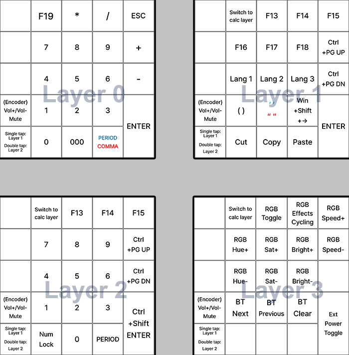

# zm-duc-k
Initial release: May 2022

A ZMK-based firmware for bluetooth wireless version of [Duckboard](https://doodboard.xyz/products/duckboard) macropad using the [nice!nano v2.0](https://nicekeyboards.com/nice-nano/) MCP. Derived from works by [jackh2000](https://github.com/jackh2000/zmk/tree/main/app/boards/shields/duckboard) and [nowyouare](https://github.com/nowyouare/zmk/releases/tag/v1.0), it updates the base ZMK package from 2.5.0 to the latest version to make use of macro and tap dance functions.

## Installation
1. [Download duckboard-nice_nano_v2-zmk.uf2]([url](https://github.com/butterdori/zmk-config/releases))
2. Connect using USB and put it into bootloader mode (short GND and RST pins twice quickly)
3. Nice Nano will appear as a storage on your computer.
4. Copy the UF2 file to Nice Nano and disconnect

## Layout
- The firmware consists of 4 layers: Layer 0 - Calc; Layer 1 - Apps and Func; Layer 2 - Game; Layer 3 - RGB and Bluetooth.
- Assigning F19 as a shortcut to calculator means double tapping the key switches the layer to the calcaultor layout and launches calculator. 
- F13~F18 can be assigned to other programs, or used as you see fit. 
- Ctrl+Pg Up/Dn can be used to move between tabs in the browser. 
- Lang 1/2/3 keys are actually Ctrl+Shift+1/2/3, which can be assigned to the different language keyboards you are using. 
- Parentheses and quotations enter both endings and presses the left arrow key once, placing you in the middle. 
- Win+Shift+Left arrow key moves the selected window to your right monitor (if already in the right monitor, it goes to the left monitor). 
- Ext Power Toggle is used when the OLED is not functioning, which can happen due to current limitations in ZMK displays. 
- Number keys for layer 2 are keypad keys, and thus should be used in conjunctino with Num Lock.

Red: Tap  
Blue: Hold

**Combo keys (usable in all layers; layer 0 assignments):**  
Num Lock + ESC: Boot to bootloader (install firmware)  
Num Lock + /: Reset  
Num Lock + 7: Next Bluetooth profile (max 3 devices; can be changed)  
Num Lock + 8: Previous Bluetooth profile  
Num Lock + 9: Clear Bluetooth profiles  
Num Lock + 1: Switch to calc layer (0)  
Num Lock + 2: Switch to apps layer (1)  
Num Lock + 3: Switch to game layer (2)  
Num Lock + 4: Switch to RGB & Bluetooth layer (3)  
Num Lock + 0: Toggle RGB  
